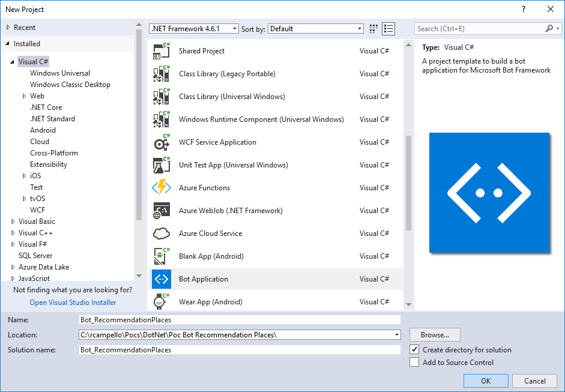
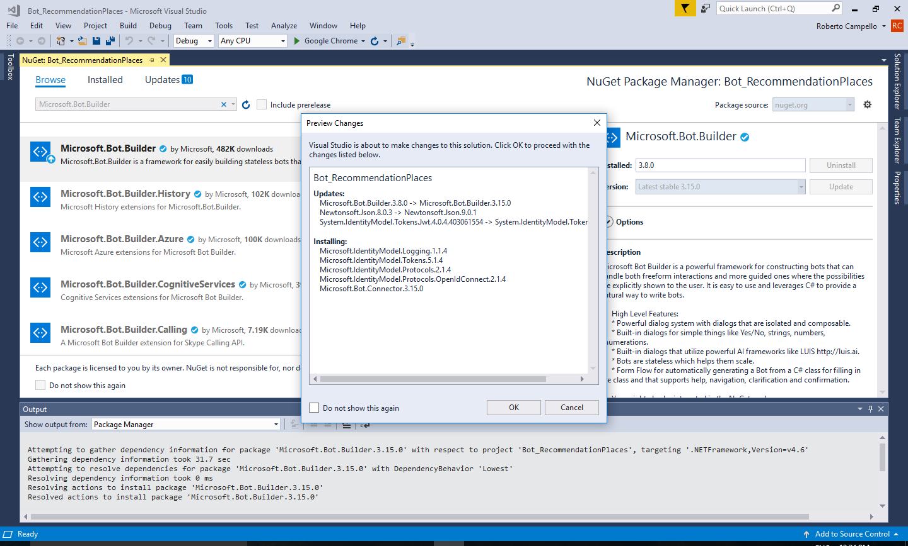
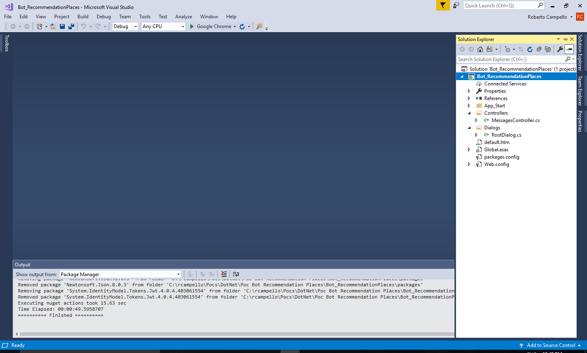

# Criando Bots com o Microsoft Bot Framework
Tutotial demonstrando a criação de Bots com o **Microsoft Bot Framework**.

O Microsoft Bot Framework foi criado para ajudar na criação de bots. Bots são robôs pré programados que podem interagir com os usuários naturalmente nos mais diversos canais como Skype, Facebook e outros serviços de mensagens.

Usando a SDK, você pode construir bots utilizando as seguintes SDK features:

* Sistema de diálogos que podem ser utilizados de forma isolada ou composto
* Prompts para interações simples como Yes/No, strings, numbers, e enumerations
* Diálogos que utilize AI frameworks como o [LUIS](https://www.luis.ai/home)
* FormFlow para gerar automaticamente um bot (através de uma classe C#) que direciona o usuário através da conversação, fornecendo ajuda, navegação, entendimento e confirmação

Este tutorial demonstra como você pode construir bots usando o template Bot Application e o Bot Builder SDK for .NET, e como testá-lo com o Bot Framework Emulator.

## Pré-Requisitos

1. Instale o [Visual Studio 2017](https://www.visualstudio.com/downloads/) – Pode ser o community;
2. Faça o download dos arquivos zip do **Bot Application**, **Bot Controller**, e **Bot Dialog**. Instale o projeto template copiando o arquivo **Bot Application.zip** para o diretório projects template do seu Visual Studio e copie os arquivos **Bot Controller.zip** e Bot Dialog.zip para o diretório item templates do seu Visual Studio.
3. Faça o download do [Bot Emulator](https://github.com/Microsoft/BotFramework-Emulator) - Necessário para teste do BOT;

***Dica***: Geralmente as pastas project templates e item templates do Visual Studio, ficam localizadas respectivamente nos caminhos: 
```html
%USERPROFILE%\Documents\Visual Studio XXXX\Templates\ProjectTemplates\Visual C#\
%USERPROFILE%\Documents\Visual Studio XXXX\Templates\ItemTemplates\Visual C#\
```
Sendo **XXXX** o valor corresponde a versão do Visual Studio instalada.

## Conceitos Chaves

#### Connector
The [Bot Framework Connector](https://docs.microsoft.com/en-us/azure/bot-service/dotnet/bot-builder-dotnet-connector) fornece uma simples API REST que habilita a comunicação de um bot através de diversos canais como Skype, Email, Slack, e muito mais. Facilitando a comunicação entre o bot e o usuário transmitindo mensagens do bot para o canal e do canal para o bot.

No Bot Builder SDK for .NET, a biblioteca [Connector](https://docs.microsoft.com/en-us/dotnet/api/microsoft.bot.connector?view=botconnector-3.12.2.4) habilita acesso ao Connector.

#### Activity
O Connector usa um objeto [Activity](https://docs.microsoft.com/en-us/dotnet/api/microsoft.bot.connector.activity?view=botconnector-3.12.2.4) para passar informações entre o bot e o canal (usuário). O tipo mais comum de activity é o message, mas existem outros tipos que podem ser usados para comunicação de vários tipos de informação de um bot ou canal.

Para maiores detalhes sobre Activities no Bot Builder SDK for .NET, acesse [Activities overview](https://docs.microsoft.com/en-us/azure/bot-service/dotnet/bot-builder-dotnet-activities).

#### Dialog
Quando você cria um bot usando a framework Bot Builder SDK for .NET, você pode usar dialogs para modelar uma conversação e gerenciar o [fluxo de conversações](https://docs.microsoft.com/en-us/azure/bot-service/bot-service-design-conversation-flow#dialog-stack). Um dialog pode ser composto de outros dialogs para aumentar o reuso, e o contexto do dialog que mantém a [pilha de dialogs](https://docs.microsoft.com/en-us/azure/bot-service/bot-service-design-conversation-flow) que estão ativos na conversação em qualquer momento.

No Bot Builder SDK for .NET, a biblioteca [Builder](https://docs.microsoft.com/en-us/dotnet/api/microsoft.bot.builder.dialogs?view=botbuilder-3.12.2.4) permite que você gerencie dialogs.

#### FormFlow
Você pode usar o [FormFlow](https://docs.microsoft.com/en-us/azure/bot-service/dotnet/bot-builder-dotnet-formflow) do Bot Builder SDK for .NET para simplificar a construção de um bot que coleta informações do usuário. Por exemplo, um bot que recebe pedidos de pizza deve coletar diversas informações do usuário como por exemplo, o sabor, o tamanho, entre outras informações. Através de guidelines básicos, o FormFlow pode automaticamente gerar o diálogo necessário para gerenciar a conversação. Neste tutorial vamos demonstrar a criação de um bot utilizando FormFlow.

## Criando o seu Bot

Primeiro, abra o Visual Studio e crie um novo projeto C#. Escolha o template Bot Application para o seu novo projeto.



Usando o template Bot Application, você cria o projeto já contendo todos os componentes que são requeridos para construir uma simples aplicação bot, incluindo a referência para a framework Bot Builder SDK for .NET, ```Microsoft.Bot.Builder```. Verifique se as referências do projeto possuem a última versão da SDK seguindos os passos abaixo:

1. Clique com botão direito no projeto e selecione Manage NuGet Packages.
2. Na aba Browse, digite "Microsoft.Bot.Builder".
3. Localize o package Microsoft.Bot.Builder na lista de resultados e clique no botão Update do package.
4. Clique em OK na caixa de dialogo e após aceite as mudanças para confirmar as atualização.



## Explorando o código

Uma vez, tendo o projeto criado a seguinte estrutura de diretórios será definida para solution, conforme figura abaixo:



**A Classe MessageController**

Dentro da pasta **Controllers** é criada a classe **MessagesController.cs**. Esta classe possui o método chamado ```Post```, responsável por receber a mensagem do usuário e invocar o root dialog.

```C#
[BotAuthentication]
public class MessagesController : ApiController
{
    /// <summary>
    /// POST: api/Messages
    /// Receive a message from a user and reply to it
    /// </summary>
    public async Task<HttpResponseMessage> Post([FromBody]Activity activity)
    {
        if (activity.Type == ActivityTypes.Message)
        {
            await Conversation.SendAsync(activity, () => new Dialogs.RootDialog());
        }
        else
        {
            HandleSystemMessage(activity);
        }
        var response = Request.CreateResponse(HttpStatusCode.OK);
        return response;
    }
    ...
}
```
